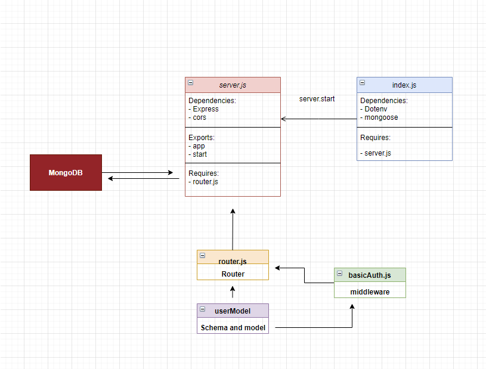

# basic-auth

## Description

Phase 1 Requirements
Today, we begin the first of a 3-Phase build of an authentication system, written in Express. The following core requirements detail the functionality for this phase of the project.

As a user, I want to create a new account so that I may later login
Using a tool such as httpie, postman, or a web form:
Make a POST request to the/signup route with username and password
Your server should support both JSON and FORM data as input
On a successful account creation, return a 201 status with the user object in the body
On any error, trigger your error handler with an appropriate error
As a user, I want to login to my account so that I may access protected information
Using a tool such as httpie, postman, or a web form:
Make a POST request to the /signin route
Send a basic authentication header with a properly encoded username and password combination
On a successful account login, return a 200 status with the user object in the body
On any error, trigger your error handler with the message “Invalid Login”
Technical Requirements / Notes
You have been supplied a “monolithic” express server in the starter-code folder which fulfills the above requirements. To complete the work for this phase, refactor the provided server using best practices, modularizing the code and providing tests, as follows:

Basic Server
Extract the core server logic into 2 files:
index.js (entry point)
Connect to the database
Require the ‘server’ and start it
server.js service wiring
Exports an express app/server and a start method
Authentication Modules
Keep your authentication related files in a folder called /auth so they are independent of the server itself

Extract the authentication logic for /signin as middleware
Create a new node module
Interact with the headers and the users model
Add the user record (if valid) to the request object and call next()
Call next() with an error in the event of a bad login
Extract the mongo/schema into a separate module
Model the user data
Add a pre-save hook in the model … Before we save a record:
Hash the plain text password given before you save a user to the database
Create a method in the schema to authenticate a user using the hashed password
Create a module to house all of routes for the authentication system.
Create a POST route for /signup
Accepts either a JSON object or FORM Data with the keys “username” and “password”
Creates a new user record in a Mongo database
Returns a 201 with the created user record
Create a POST route for /signin
Use your basic authentication middleware to perform the actual login task
router.post('/signin', basicAuth, (req,res) => {});
When validated, send a JSON object as the response with the following properties:
user: The users’ database record
Testing
You should manually test your routes using httpie from the command line or an application such as Postman or Insomnia. Additionally, you are required to write automated tests as well:

POST to /signup to create a new user
POST to /signin to login as a user (use basic auth)
Need tests for auth middleware and the routes
Does the middleware function (send it a basic header)
Do the routes assert the requirements (signup/signin)
This is going to require more “end to end” testing that you’ve done in the past
To test signin, your tests actually need to create a user first, then try and login, so there’s a dependency built in
Ensure that you use supergoose to test your routes and your database
Visual Validation
We have deployed a web application that’s designed to test your API. This is a good way to ensure that your API works as expected. There’s nothing to “turn in” here, this is provided for your benefit.

Open this Web Application
Click the “Module 3 (AUTH)” / Basic Auth link
In the form at the top of the page, enter the URL to your Authentication Server
If your lab is working, this app will show your user record after you login

## Links

Heroku Link: https://basic-auth-yazan.herokuapp.com/

Github Actions: https://github.com/yazantafesh/basic-auth/actions

Pull Request: https://github.com/yazantafesh/basic-auth/pull/1

## UML

